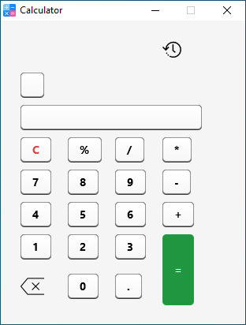
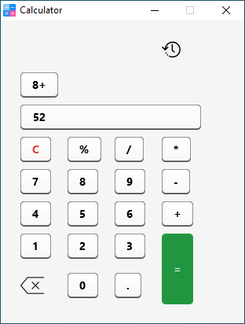

# Calculator

    

        
    

 
    

<!-- Contents -->

# Contents

- [About the Project](#about-the-project)
  - [Features](#features)
- [Getting Started](#getting-started)
  - [Prerequisites](#prerequisites)
  - [Run locally](#run-locally)
- [Screenshots](#screenshots)

<!-- About the Project -->

## About the Project

A simple calculator app developed for "Programming with Java" while I was at university.

<!-- Features -->

### Features

This calculator has the basics features of similar apps:

- Basic Μathematical Οperations (Doesn't support parentheses)
- Keyboard/Numpad support
- History page

<!-- Getting Started -->

## Getting Started

<!-- Prerequisites -->

### Prerequisites

- Java JDK [here](https://www.oracle.com/java/technologies/javase/javase8-archive-downloads.html)
- JavaFX [here](javafx-sdk-13.0.1.rar)
- IDE (Although it was build with Netbeans, I suggest to use IntelliJ IDE)

<!-- Run Locally-->

### Run Locally

Running it locally is pretty forward. Just open the project in your IDE of choice and run it.

<!-- Usage -->

## Usage

It works exactly as a calculator. You can either use the UI or your Keyboard/Numpad.

## Screenshots

